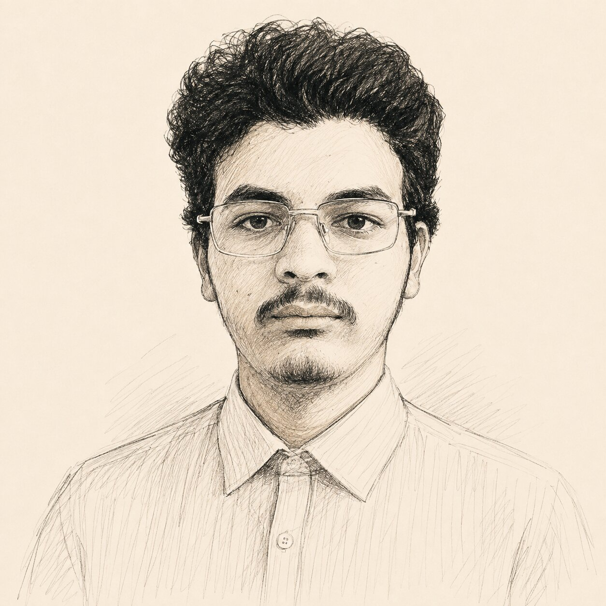

# Fouad Dadache — Personal Portfolio

Static HTML/CSS/JS — no build step, no Node.js, no dependencies.

## Structure

```
fouad-site/
├── index.html        ← Single HTML page
├── css/
│   ├── tokens.css    ← Design tokens (colors, fonts, spacing)
│   └── layout.css    ← All component styles + responsive
├── js/
│   ├── data.js       ← All content in English & French
│   └── main.js       ← Rendering, animations, interactions
└── assets/           ← Put your photo here
```

## Add Your Photo

1. Put your photo in `assets/photo.jpg`
2. In `index.html`, find `.hero-photo` and replace the placeholder div with:

```html
<div class="hero-photo">
  
</div>
```

## Edit Content

All text (EN + FR) is in `js/data.js`. Edit `DATA.en` and `DATA.fr`.

## Run Locally

Open `index.html` directly in any browser. Or use any static server:

```bash
# Python
python3 -m http.server 3000

# Node (npx)
npx serve .
```

## Deploy to GitHub Pages

```bash
git init
git add .
git commit -m "Initial portfolio"
git remote add origin https://github.com/YOUR_USERNAME/fouad-portfolio.git
git push -u origin main
```

Then on GitHub: **Settings → Pages → Source: main branch → / (root) → Save**

Your site will be live at `https://YOUR_USERNAME.github.io/fouad-portfolio`

## Deploy to Vercel

```bash
# Just drag & drop the folder on vercel.com
# OR connect the GitHub repo on vercel.com → Import → Deploy
```

Zero configuration needed — Vercel detects static HTML automatically.
